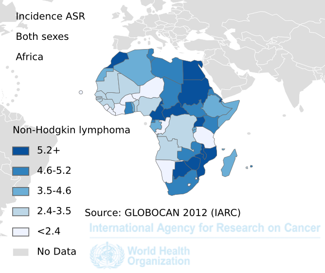
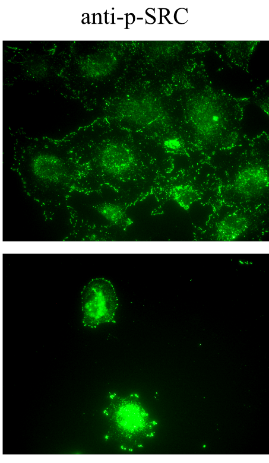

<!-- Limit image width and height -->
<style type="text/css">
img {     
  max-height: 480px;     
  max-width: 600px; 
}
</style>

<style> .title-slide {
  background-color: #FFFFFF; /*#CBE7A5 #EDE0CF; ; #CA9F9D*/
}

.title-slide hgroup > h1{
 font-family: 'Oswald', 'Helvetica', sanserif; 
}

.title-slide hgroup > h1, 
.title-slide hgroup > h2 {
  color: #535E43 ;  /* ; #EF5150*/
}
</style>

<!-- Center image on slide -->
<script type="text/javascript" src="http://ajax.aspnetcdn.com/ajax/jQuery/jquery-1.7.min.js"></script>
<script type="text/javascript">
$(function() {     
  $("p:has(img)").addClass('centered'); 
});
</script>

<!-- Italic -->
<style>
em {
  font-style: italic
}
</style>

<!-- Bold -->
<style>
strong {
  font-weight: bold;
}
</style>

--- .segue .dark .nobackground
## Recap

--- &twocol bg:lavender
## Lihtsad retroviirused transformeerivad kana ja hiire rakke

***=left


***=right


Mehhanism: **insertsiooniline mutagenees** 

---


----
## Inimese tuumorviirused

- Insertsioonilist mehhanismi pole

- Kliiniliselt olulistest vähkidest on viirustega seotud  

  - **emakakaela kasvajad**, ~100% nakatunud papilloomiviirusega *HPV 16/18* ja 
        - kuues kõige sagedasem kasvaja naistel (16. mõlema soo kokkuvõttes)   
  - **maksakartsinoomid**, B ja C hepatiit *HCV ja HBV* - 80% maksakasvajatest

- Haruldasematest
  - **Burkitt'i lümfoom**, Epstein-Barri viirus *EBV* - 2.5% lümfoomidest


---
## Emakakaela kasvajad

```{r cervical, echo=FALSE,  fig.align = 'center', fig.cap= "Emakakaela kasvajad (C53), esmaleiud vanusegrupiti, UK, 2009-2011"}
library(ggplot2)
cc <- read.csv("cervicalcancer.csv")
qplot(x=Age.Range,y=Female.Rates, data=cc, stat="identity", geom="bar", fill="red") + ylab("Intsidents 100,000 kohta (naised)") + xlab("Vanusegrupid") +
  ggtitle("Emakakaela kasvajad (C53), esmasleiud vanusegrupiti, UK, 2009-2011")+ guides(fill=FALSE) + 
  theme(axis.text.x  = element_text(angle=90, vjust=0.5))
```

<p style="font-size:12px">Bosch FX, Lorincz A, Muñoz N, et al. The causal relation between human papillomavirus and cervical cancer. J Clin Path 2002; 55(4):244-265.</p>

---
## Expression levels of genes typically altered in cervical carcinomas with HPV integration


---&twocol
## Maksakasvajate intsidents langeb kokku HCV või HBV nakkusega

***=left
- Maades kus B ja C heptiit on laialt levinud, on ka  HCC intsidents õrge.
- This finding is consistent with the fact that about three-quarters of HCCs are attributed to chronic HBV and HCV infections.

***=right


--- &twocol

***=left
## Malaaria võimaldab EBV-l 'kapist välja' tulla 

***=right




--- .segue .dark .nobackground
## Kuidas seletada vähi teket inimesel

--- bg:lavender
## Hüpotees: endogeensed proviirused

- Lähtudes retroviiruste elutsüklist, integreeruvad genoomi **endogeensete retroviirustena**,
- satuvad idutee rakkudesse ja muutuvad pärilikuks,
- enamasti vaikeolekus, ei transkribeeri oma geene,
- juhuslik ning harv aktiveerumine.

--- bg:lavender
## Endogeensed proviirused hiirtel

- BrdU aktiveerib Akr liini hiirtel endogeensed retroviirused (*MLV*)
    - DNA metülatsioon eemaldatakse lookusest ja vaigistamine kaob
- Akr liini hiirtel on kaks lookust kuhu on integreerunud replikatsiooni-kompetentne MLV
- MLV produktsioon viib leukeemia tekkele.


--- bg:lavender
## Inimese ERV-d... FUBAR

- 8% inimese genoomist pärineb retroviirustest, kuid
- inimese kasvajatest pole leitud retroviiruseid ega jälgigi nendest (pöörd-transkriptaas),
- inimese LTR-i sisaldavad järjestused on pärit vähemalt >5M aasta tagusest ajast, 
    - tugevasti muteerunud, 
    - mittefunktsionaalsed,
    - läbinud geenitriivi ja fikseerunud (populatsioonis on kõigil identne lookus).
- HERV-K alamperekonnas on lookuseid millel on kõik ORF-id intaktsed, kuid viirust neilt ei toodeta ja neid pole ka vähkides leitud 

---
## Mis tekitab vähki? Kartsenogeenid!

Kartsenogeenid toimivad mutageenidena ja nende toime-mehhanismiks on raku kasvukontrolli geenide muteerimine **onkogeenideks**.

$$\color{green}{normaalne\; kasvu kontrolli\; geen} \quad \underrightarrow{\times\; \color{red}{mutageen}} \quad \color{yellow}{onkogeen} $$


--- &twocol
## Keemilised kartsenogeenid

***=left


Katsusaburō Yamagiwa

***=right
- 1915. aastal demonstreeris **pigi** kartsenogeense toime
- pintseldas küüliku kõrvu igapäevaselt pigiga,
- mitu kuud hiljem moodustus lamerakuline kartsinoom.

**Näitas, et kasvajaid on võimalik esile kutsuda**


---
## Paradigma: kartsenogeenid toimivad mutageenidena

<q>Füüsilise või keemilise katserogeeni poolt transformeerunud rakud kannavad muteerunud geene - *onkogeene* - , mis rikuvad normaalse kasvukontrolli.</q>

--- &twocol bg:pink
## DNA transfektsioon võimaldas isoleerida mitte-viraalsed onkogeenid

***=left
- Hiire C3HT1/2 rakke transformeeriti *3-Methylcholanthrene* (3-ME, MCA) abil,
- transformeerunud rakkudest isoleeriti genoomne DNA,
- eraldatud DNA transformeeriti mitte-tumorigeensetesse NIH3T3 rakkudesse,
- isoleeriti kolooniad mis olid transformeerunud ja tumorigeensed.
- *Sama loogika toimib ka inimese vähirakkudest eraldatud DNA korral.*

***=right


<p style="font-size:10px">Credit: Sue Weil, Memorial Sloan-Kettering Cancer Center</p>

--- bg:pink
## 1 onkogeen = 1 transformeerunud rakk/koloonia

- Transformeerunud rakkude genoomse DNA fragmentide **transfekteerimisel läheb rakku sisse 0.1% doonor DNA-d**.
- Tõenäosus, et kaks lingitud geeni satuvad ühte rakku on $$10^{-3} \times 10^{-3} = 10^{-6} $$ 

<q>Kokkuvõte: onkogeenid tekivad ka viirustest sõltumatult.</q>

--- &twocol bg:pink
## Retroviiruste poolt aktiveeritud onkogeenid on samad mis mitte-viraalsete kartsenogeenide aktiveeritud

- 1982. Parada et. al: Harvey roti sarkoomiviiruse H-ras proov hübridiseerub inimese kusepõie kartsinoomi DNA-ga transfekteeritud NIH3T3 rakkude genoomsele DNA-le.

***=left


***=right


----
## Inimese kasvajatest leitud retroviraalsed onkogeenid, näited

Viirus | Liik | Onkogeen | Onkovalk | Inimese kasvaja
-------|------|----------|----------|----------------------------
Rousi sarkoom | kana | src | mitte-retseptor TK | käärsoole vähk
Abelsoni leukeemia | hiir | abl | mitte-retseptor TK | CML
Lindude erütroblastoos | hiir | erbB | retseptor TK | mao-, kopsu- ja rinnavähk
McDonough' kassi sarkoom | kass | fms | retseptor TK | AML
Hardy-Zuckerman kassi viirus | kass | kit | retseptor TK | GI strooma vähk
Hiire sarkoom 3611 | hiir | raf | Ser/Thr kinaas | kusepõie kartsinoom
*Simian sarcoma* | ahv | sis | kasvufaktor (PDGF) | erinevad vähid
Harvey' sarkoom | hiir/rott | H-ras | väike G-valk | kusepõie kartsinoom
Kirsten'i sarkoom | hiir/rott | K-ras | väike G-valk | erinevad vähid
Lindude erütroblastoos E26 | kana | ets | transkriptsioonifaktor | leukeemia
Lindude müelotsütoom | kana | myc | transkriptsioonifaktor | erinevad vähid
Retikuloendotelioos | kalkun | rel | transkriptsioonifaktor | lümfoom

---
## MYC 

- Üks esimesi onkogeene mis avastati peale src-i, lindude müelotsütoomi viirus  MC29-st
- Heterodimeerne transkriptsioonifaktor, peab dimeriseeruma teise bHLH TF-ga: 
      - ainult MYC:MAX heterodimeer seob DNA-le ja aktiveerib transkriptsiooni
- MAX seob MYC-perekonna valke: MYC, MYCN, MYCL
- MYC TF seostub *E-box* järjestusele *CACGTG*
- MYC vähid: Burkitti lümfoom, neuroblastoom
- Onkogeenseteks mutatsioonideks on transkriptsiooni üles-regulatsioon ja amplifikatsioon

---
## ERBB

- Kireldati algselt lindude erütroblastoosi tüvest R aastal 1935
    - R-tüvi sisaldas kahte rakulist onkogeeni erbA a erbB
        - erbA osutus hiljem mitte obligatoorseks hormoonretseptoriks
        - **erbB oli transformatsiooniks vajalik ja piisav**
- Membranne türosiin-kinaas, homoloogne EGF retseptoriga 
- Võrreldes EGFR-iga oli ErbB-l ekstratsellulaarne osa deleteerunud
    - selline deletsioonimutant ei seo ligandi (EGF), kuid on konstitutiivselt aktiivne
- inimesel glioblastoomides tavaline analoogne mutant **EGFRvIII**, kus on deleteerunud eksonid 2-7
- rinnakasvajates HER2/ERBB2/Neu lookuse amplifikatsioon 80% sagedusega *HER2-enriched* subtüübis  

--- &twocol
## SRC

***=left
- Huvitaval kombel SRC-i inimese kasvajatest eriti ei leitud
    - esineb ~12% kaugele arenenud käärsoole kartsinoomides *colorectal carcinoma*
- Src-perekonna kinaasid *Src family kinases (SFK)* on (Src, Fyn, Yes, Lck, Lyn, Hck, Fgr and Blk)
- Paradoksaalselt SRC näiteks rakkude jagunemist ei mõjuta, **toimib adhesioonides ja on seotud vähi invaseerumisega**.

***=right



--- .segue .dark .nobackground
## Inimese proto-onkogeenide aktivatsioonimehhanismid

---
## Viirustes

- Retroviirusega seotud onkogeenide puhul läheb geen raku kontrolli alt viiruse kontrolli alla
    - myc ekspressioon on füsioloogilistes tingimustes kasvufaktorite kontrolli all
    - AMV (*Avian Myeoloblastosis Virus*) genoomis hakatakse aga myc järjestust **konstitutiivselt ekspresseerima**.


---
## Mutatsioonid

Lisaks amplifikatsioonile ja üle-ekspressioonile on ka **mutatsioonid**

- H-ras mis isoleeriti inimese kusepõie kartsinoomist ei olnud amplifitseerunud,
- sekveneerimine näitas somaatilist G->T punktmutatsiooni, mis oli täiesti piisav et H-ras onkogeeniks muuta
- Vähides esinev mutatsioon koodonites 12 või 61 (G12V) muudab Ras-i konstitutiivselt aktiivseks, rikkudes GAP (*GTP-ase activating protein*) valgu seostumise


---
## Ras-i mutatsioonid

Ras geenid on vähkides ühed sagedamini muteerunud geenidest (TCGA andmetel läbilõikes 10%)

Vähipaige/tüüp | % muteerunud RAS geeniga (homoloog)
---------|-------------------------
kõhunääre | 90 (K)
kilpnääre (papillaarne) | 60 (H,K,N)
kilpnääre (follikulaarne) | 55 (H,K,N)
käärsool | 45 (K)
seminoom | 45 (K,N)
müelodüsplaasia | 40 (N,K)
kops (mitte-väikserakuline) | 35 (K)
AML | 30 (N)
maks | 30 (N)
melanoom | 15 (K)
kusepõis | 10 (K)
neer | 10 (H)

---
## Onkogeenide aktivatsioonimehhanismid

- Regulatoorsed (amplifikats, deletsioon)
- Struktuursed (mutatsioonid)
- Regulatoorsed $\times$ Struktuursed


--- 
## MYC-i aktivatsiooniks kolm mehhanismi 

Kolm mehhanismi, kõik regulatoorsed:
- proviiruse integratsioon (linnud)
- geeni amplifikatsioon (inimene)
- kromosomaalsed translokatsioonid


--- &twocol
## N-MYC amplifikatsioon pärilikes neuroblastoomides

***=left

Kahte tüüpi amplifikatsioone
- HSR, homogeenselt värvuvad piirkonnad
- DM, *double minutes*: kromosoomi välised partiklid
- amplifikatsioonid on bimodaalsed 10-30 koopiat ja 100-150 koopiat
- lisaks neuroblastoomidele ka teistes neuroektodermaal kasvajates, astrotsütoomid, glioomid, ka väikse-rakulises kopsukasvajas.

***=right


--- &twocol
## Sagedamini amplifitseerunud genoomipiirkonnad

***=left


***=right

Significantly recurrent focal SCNAs

<p style="font-size:12px">Pan-cancer patterns of somatic copy number alteration
Travis I Zack,  Steven E Schumacher,	Scott L Carter,	Andrew D Cherniack,	Gordon Saksena,	Barbara Tabak,	Michael S Lawrence,	Cheng-Zhong Zhang,	Jeremiah Wala,	Craig H Mermel,	Carrie Sougnez,	Stacey B Gabriel,	Bryan Hernandez,	Hui Shen,	Peter W Laird,	Gad Getz,	Matthew Meyerson	& Rameen Beroukhim Nature Genetics 45, 1134–1140 (2013) doi:10.1038/ng.2760</p>

Top 10:

Geen | Funktsioon
-----|-----------
CCND1 | G1 tsükliin
EGFR | TK retseptor
MYC | transkripts. faktor
ERBB2 | TK retseptor
CCNE1 | G1 tsükliin
MCL1 | anti-apoptootiline valk
MDM2 | p53 E3 ubikvitiini ligaas

--- &twocol
## MYC translokatsioon

MYC aktivatsioon translokatsioonilise mehhanismi teel

***=left
- Burkitti lümfoomides
- c-myc geene translokeeritakse immunoglobuliini lookusesse kõigis BL.
- Immunoglobulin raske ahel IgH 80%,
$\kappa$ või $\lambda$ kerge ahel, kumbagi 10%.

Translokatsioon | Fuusion | Sagedus
----------------|--------|--------
t(8;14)(q24;q32)| IGH/MYC | 80%
t(2;8)(p12;q24) | IGK/MYC | 10%
t(8;22)(q24;q11) | IGL/MYC | 10 %

***=right


---
## Kokkuvõte

- **Onkogeen** on geen mis võib potentsiaalselt vähki tekitada ja vähkides on nad muteerunud või ekspresseeritud ebanormaalselt kõrgel tasemel.
- **Proto-onkogeen** on normaalne geen mis võib muutuda onkogeeniks.

---
## Refs

- Natalie Teich, Douglas R. Lowy, Janet W. Hartley, Wallace P. Rowe, Studies of the mechanism of induction of infectious murine leukemia virus from AKR mouse embryo cell lines by 5-iododeoxyuridine and 5-bromodeoxyuridine, Virology, Volume 51, Issue 1, January 1973, Pages 163-173, ISSN 0042-6822, [http://dx.doi.org/10.1016/0042-6822(73)90376-0.](http://www.sciencedirect.com/science/article/pii/0042682273903760)
