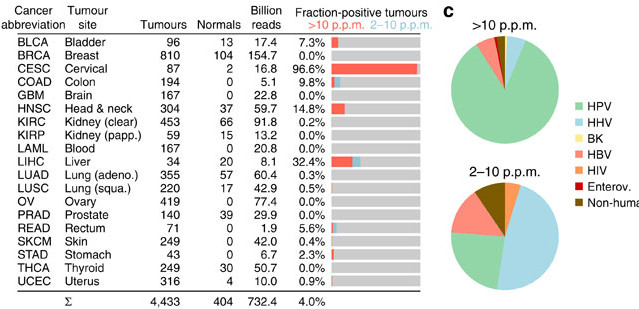
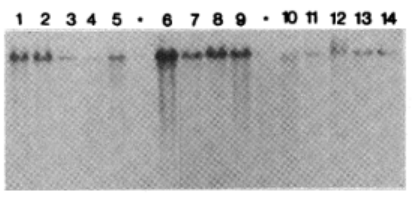
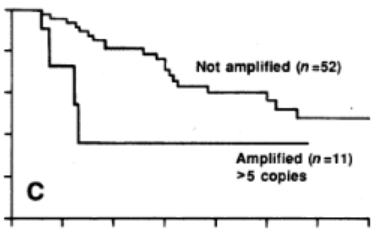
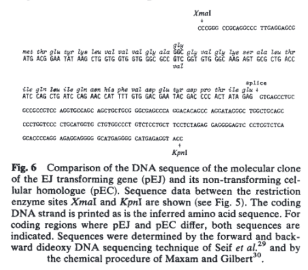

```{r setup, include=FALSE}
knitr::opts_chunk$set(echo = FALSE, message = FALSE, warning = FALSE, fig.align = 'center', dev = "svg")
```


class: inverse, middle, center

# Recap

---

## Lihtsad retroviirused
transformeerivad kana ja hiire rakke läbi insertsioonilise mutageneesi

.pull-left[

```{r, out.width=200}
knitr::include_graphics("http://o.quizlet.com/i.WMzcRr-oCjtmBh2GiwwA.png")
```

]

.pull-right[
  
```{r}
knitr::include_graphics("http://o.quizlet.com/xJ0AWub9I3KjpnUom79whw.png")
```

]


---

## Inimese vähid kus esineb kõrge viirusekspressioon

```{r}

```

.footer[Pilt: [The landscape of viral expression and host gene fusion and adaptation in human cancer](http://www.nature.com/ncomms/2013/131001/ncomms3513/full/ncomms3513.html)
]

---

## Viiruse integratsioon on seotud märklaudgeenide ekspressiooni muutustega

```{r}
knitr::include_graphics("https://images.nature.com/w926/nature-assets/ncomms/2013/131001/ncomms3513/images_hires/ncomms3513-f5.jpg")
```


.footer[
Pilt: [The landscape of viral expression and host gene fusion and adaptation in human cancer](http://www.nature.com/ncomms/2013/131001/ncomms3513/full/ncomms3513.html)
]

---

## HPV16/18 põhjustab emakakaela kasvajaid

```{r cervical, fig.height=4, fig.width=4}
library(dplyr)
library(tidyr)
library(purrr)
library(ggplot2)
library(ggthemes)
library(gridExtra)
cc <- read.csv("data/cervicalcancer.csv")
pk30 <- boulder::json_to_df("data/PK30.json")
pk30filt <- select(pk30, Aasta, Sugu, Vanuserühm, value) %>% 
  filter(complete.cases(.))
  
pk30filt <- pk30filt %>% 
  mutate(Vanuserühm = as.character(Vanuserühm))
mut_vanus2 <- function(x){
  
  bounds <- strsplit(x, split = "-") %>% 
    unlist() %>% 
    sub(" ja vanemad", "", .) %>% 
    as.numeric()
  
  ages <- sapply(bounds, 
                 function(x){
                   if(x<10){
                     if(x==0){
                       return(x)
                     } 
                     x <- paste0("0", x) 
                   } 
                   x <- as.character(x)
                   if(x=="85") {
                     x <- paste0(x, "+")
                   }
                   x
                 })
  
  paste(ages, collapse = " to ")
}

pk30filt <- mutate(pk30filt, Vanuserühm = map_chr(Vanuserühm, mut_vanus2))

pk30sum <- group_by(pk30filt, Vanuserühm, Sugu) %>% 
  summarise(Juhud = mean(value, na.rm = T))
pk30sum <- select(pk30sum, Age.Range=Vanuserühm, Female.Rates=Juhud)
cervical_cancer <- bind_rows(select(cc, Age.Range, Female.Rates), pk30sum, .id = "id")
cervical_cancer <- left_join(cervical_cancer, data_frame(id = c("1", "2"), Riik = c("UK","Eesti")))
cervical_cancer <- mutate(cervical_cancer, Age.Range = sub(" to ", "-",  Age.Range))
ggplot(cervical_cancer, aes(x = Age.Range, y = Female.Rates, color = Riik)) + 
  geom_line(aes(group = Riik)) +
  geom_point() +
  ylab("Intsidents 100,000 kohta (naised)") + 
  xlab("Vanusegrupid") +
  ggtitle("Emakakaela kasvajad (C53)\nUK: 2009-2011, Eesti: 2000-2014 ") + 
  theme(axis.text.x  = element_text(angle = 90, vjust = 0.5)) +
  viridis::scale_color_viridis(discrete = TRUE)

```

.footer[Bosch FX, Lorincz A, Muñoz N, et al. The causal relation between human papillomavirus and cervical cancer. J Clin Path 2002; 55(4):244-265.
]

---
class: inverse, middle, center

# Kuidas seletada vähi teket inimesel

---

## Endogeensed proviirused
Kas inimese vähkide eest võiksid vastutada genoomis olevad endogeensed retroviirused?

- Lähtudes retroviiruste elutsüklist, integreeruvad genoomi **endogeensete retroviirustena**,
- satuvad idutee rakkudesse ja muutuvad pärilikuks,
- enamasti vaikeolekus, ei transkribeeri oma geene,
- juhuslik ning harv aktiveerumine.

---

## Endogeensed proviirused hiirtel

- BrdU aktiveerib Akr liini hiirtel endogeensed retroviirused (*MLV, murine leukemia virus*)
    - DNA metülatsioon eemaldatakse lookusest ja vaigistamine kaob
- Akr liini hiirtel on kaks lookust kuhu on integreerunud replikatsiooni-kompetentne MLV
- MLV produktsioon viib leukeemia tekkele.

```{r, out.width=460}
knitr::include_graphics("http://www.jimmunol.org/content/192/4/1343/F1.large.jpg")
```


.footer[Pilt: ~5% hiire genoomist sisaldab endogeenseid retroviirus järjestusi. [Endogenous Retroviruses and the Development of Cancer](http://www.jimmunol.org/content/192/4/1343.full)
]

---

## Inimese ERV-d... FUBAR

- 8% inimese genoomist pärineb retroviirustest, kuid
- inimese kasvajatest pole leitud retroviiruseid ega jälgigi nendest (pöörd-transkriptaas),
- inimese LTR-i sisaldavad järjestused on pärit vähemalt >5M aasta tagusest ajast, 
    - tugevasti muteerunud, 
    - mittefunktsionaalsed,
    - läbinud geenitriivi ja fikseerunud (populatsioonis on kõigil identne lookus).
- HERV-K alamperekonnas on lookuseid millel on kõik ORF-id intaktsed, kuid viirust neilt ei toodeta ja neid pole ka vähkides leitud.

---
class:inverse, middle, center

# Onkogeenid tekivad ka viirustest sõltumatult

---

## Kui mitte viirused, siis mis tekitab vähki? Kartsinogeenid!

- Kartsinogeenid toimivad mutageenidena ja nende toime-mehhanismiks on raku kasvukontrolli geenide muteerimine.
- Sellisteks kasvukontrolli geenideks võivad olla normaalsed raku geenid, sarnaselt retroviirustest leitud protoonkogeenidega.

```{r}
knitr::include_graphics("http://www.artrepublic.com/attachments/image/469/21469/21469_400xscale_c.jpeg")
```


.footer[
Pilt: artrepublic.com
]

---

## Keemilised kartsinogeenid kutsuvad esile kasvajaid

.pull-left[

```{r,out.height=320, fig.cap="Katsusaburō Yamagiwa"}
knitr::include_graphics("http://upload.wikimedia.org/wikipedia/commons/thumb/3/36/Yamagiwa.JPG/300px-Yamagiwa.JPG")
```

]


.pull-right[
- $1915.$ aastal demonstreeris pigi kartsinogeense toime
- pintseldas küüliku kõrvu igapäevaselt pigiga,
- mitu kuud hiljem moodustus lamerakuline kartsinoom.
]

---

## Kartsinogeenid toimivad mutageenidena

- Tugevalt mutageensed ühendid on ka tugevalt kartsinogeensed (nt. aflatoksiin B1, benso(a)püreen). 
- Füüsilise või keemilise kartsinogeeni poolt transformeerunud rakud kannavad muteerunud geene e. onkogeene, mis rikuvad normaalse kasvukontrolli.

---

## DNA transfektsioon võimaldas isoleerida mitte-viraalsed onkogeenid

.pull-left[

- Hiire C3HT1/2 rakke transformeeriti 3-metüülkolantreeni (3-ME, MCA) abil,
- transformeerunud rakkudest isoleeriti genoomne DNA,
- eraldatud DNA transformeeriti mitte-tumorigeensetesse NIH3T3 rakkudesse,
- isoleeriti kolooniad mis olid transformeerunud ja tumorigeensed.
- *Sama loogika toimib ka inimese vähirakkudest eraldatud DNA korral.*
]

.pull-right[

```{r,out.height=320}
knitr::include_graphics("http://www.ncbi.nlm.nih.gov/books/NBK190612/bin/ch6fu3.jpg")
```
]

.footer[Pilt: Sue Weil, Memorial Sloan-Kettering Cancer Center
]

---

## Kas transformeerunud raku DNA-ga transformeerumisel läheb retsipientrakku sisse üks või mitu onkogeeni?

- Transformeerunud rakkude genoomse DNA fragmentide transfekteerimisel läheb rakku sisse 0.1% doonor DNA-d.
- Tõenäosus, et kaks lingitud geeni satuvad ühte rakku on $$10^{-3} \times 10^{-3} = 10^{-6} $$ 
- Selline tõenäosus on piisavalt väike väitmaks, et "1 onkogeen = 1 transformeerunud rakk/koloonia"

???

Mida see tähendab?

---

## Retroviiruste poolt aktiveeritud onkogeenid on samad mis mitte-viraalsete kartsinogeenide aktiveeritud

- Harvey roti sarkoomiviiruse H-ras proov hübridiseerub inimese kusepõie kartsinoomi DNA-ga transfekteeritud NIH3T3 rakkude genoomsele DNA-le ([Parada et al., 1982](http://www.ncbi.nlm.nih.gov/pubmed/6283357):  paremal).

.pull-left[

```{r, out.width=240}
knitr::include_graphics("http://missinglink.ucsf.edu/lm/molecularmethods/images/blotting_clip_image001.gif")
```

]

.pull-right[

```{r}
knitr::include_graphics("http://o.quizlet.com/xr9WvHaD36Lp0zMgy4XrtQ_m.png")
```

]

---

## Inimese vähkide retroviraalsed onkogeenid

```{r}
tab <- readr::read_delim("Viirus | Liik | Onkogeen | Onkovalk | Inimese kasvaja
Rousi sarkoom | kana | src | mitte-retseptor TK | käärsoole vähk
Abelsoni leukeemia | hiir | abl | mitte-retseptor TK | CML
Lindude erütroblastoos | hiir | erbB | retseptor TK | mao-, kopsu- ja rinnavähk
McDonough' kassi sarkoom | kass | fms | retseptor TK | AML
Hardy-Zuckerman kassi viirus | kass | kit | retseptor TK | GI strooma vähk
Hiire sarkoom 3611 | hiir | raf | Ser/Thr kinaas | kusepõie kartsinoom
Simian sarcoma | ahv | sis | kasvufaktor (PDGF) | erinevad vähid
Harvey' sarkoom | hiir/rott | H-ras | väike G-valk | kusepõie kartsinoom
Kirsten'i sarkoom | hiir/rott | K-ras | väike G-valk | erinevad vähid
Lindude erütroblastoos E26 | kana | ets | transkriptsioonifaktor | leukeemia
Lindude müelotsütoom | kana | myc | transkriptsioonifaktor | erinevad vähid
Retikuloendotelioos | kalkun | rel | transkriptsioonifaktor | lümfoom", delim ="|")
tab <- knitr::kable(tab, format = 'html')
kableExtra::kable_styling(tab, "striped", position = "left", font_size = 12)
```


---

## erbB2/neu onkogeeni amplifikatsioon rinnakasvajates

- $1987.$ a. kirjeldati, seos erbB2/neu geeni amplifikatsiooni ja rinnavähi elulemuse ning relapsi vahel.

.pull-left[

```{r, out.width=200}


```

]

.pull-right[

```{r, out.width=260}
knitr::include_graphics("http://o.quizlet.com/4hKzpWIbUoXVlJBgORKAdQ.png")
```

]

.footer[
Slamon DJ, Clark GM, Wong SG, Levin WJ, Ullrich A, McGuire WLHuman breast cancer: correlation of relapse and survival with amplification of the HER-2/neu oncogene. Science 235: 177-182.
]


---

## Protoonkogeenide aktivatsioon
Protoonkogeenide aktivatsioon toimub läbi kahte tüüpi geneetiliste muutuste:

- valguekspressiooni mõjutavad muutused
- valgu struktuuri mõjutavad muutused

---
## Valguekspressiooni mõjutavad muutused

- Normaalsetes rakkudes on protoonkogeeni ekspressioon kas alla või ülesse reguleeritud omaenda promootori poolt vastusena füsioloogilistele signaalidele

- Retroviirusega seotud onkogeenide puhul läheb geen raku kontrolli alt viiruse kontrolli alla
    - c-myc ekspressioon on füsioloogilistes tingimustes kasvufaktorite kontrolli all
    - AMV (Avian Myeoloblastosis Virus) genoomis hakatakse aga v-myc järjestust konstitutiivselt kõrgelt ekspresseerima, sõltumata füsioloogilistest signaalidest mis seda geeni varem reguleerisid.


---

## Valgu struktuuri mõjutavad muutused

.pull-left[
- H-ras isoleeriti inimese kusepõie kartsinoomist,
- H-ras ei olnud amplifitseerunud!,
- sekveneerimine näitas somaatilist G->T punktmutatsiooni, mis oli täiesti piisav et H-ras onkogeeniks muuta
- Vähides esinev mutatsioon koodonites 12 või 61 (G12V) muudab Ras-i konstitutiivselt aktiivseks rikkudes Ras-i GTPasse aktiivsuse

]

.pull-right[

```{r, out.width=400}

```

]

.footer[`r stringr::str_to_title("CLIFFORD J. TABIN, SCOTT M. BRADLEY, CORNELIA I. BARGMANN, ROBERT A. WEINBERG, ALEX G. PAPAGEORGE, EDWARD M. SCOLNICK, RAVI DHAR, DOUGLAS R. LOWY & ESTHER H. CHANG.")` Mechanism of activation of a human oncogene. Nature 300, 143 - 149 (11 November 1982); doi:10.1038/300143a0
]

---

## Ras perekonna geenid on vähkides ühed sagedamini muteerunud

```{r}
tab <- readr::read_delim("Vähipaige/tüüp | % muteerunud RAS geeniga (homoloog)
kõhunääre | 90 (K)
kilpnääre (papillaarne) | 60 (H,K,N)
kilpnääre (follikulaarne) | 55 (H,K,N)
käärsool | 45 (K)
seminoom | 45 (K,N)
müelodüsplaasia | 40 (N,K)
kops (mitte-väikserakuline) | 35 (K)
AML | 30 (N)
maks | 30 (N)
melanoom | 15 (K)
kusepõis | 10 (K)
neer | 10 (H)", delim ="|")
tab <- knitr::kable(tab, format = 'html')
kableExtra::kable_styling(tab, "striped", position = "left", font_size = 12)
```


---

## Onkogeenide aktivatsioonimehhanismid

- Regulatoorsed (protoonkogeeni amplifikatsioon, tuumorsupressorgeeni deletsioon)
- Struktuursed (mutatsioonid)
- Regulatoorsed $\times$ Struktuursed

```{r, out.width=400}
knitr::include_graphics("http://www.nature.com/ng/journal/v45/n10/images/ng.2762-F2.jpg")
```

.footer[
[Emerging landscape of oncogenic signatures across human cancers](http://www.nature.com/ng/journal/v45/n10/full/ng.2762.html)
]
---

# c-MYC aktivatsiooni mehhanismid 

Kolm mehhanismi, kõik regulatoorsed:
- proviiruse integratsioon (linnud),
- geeni amplifikatsioon (inimene),
- kromosomaalsed translokatsioonid.

---

## N-MYC amplifikatsioon pärilikes neuroblastoomides

.pull-left[

Kahte tüüpi amplifikatsioone

- HSR, homogeenselt värvuvad piirkonnad
- DM, *double minutes*: kromosoomi välised partiklid
- amplifikatsioonid on bimodaalsed 10-30 koopiat ja 100-150 koopiat
- lisaks neuroblastoomidele ka teistes neuroektodermaal kasvajates, astrotsütoomid, glioomid, ka väikse-rakulises kopsukasvajas.
]

.pull-right[
*HSR* ja *double minutes* (nooled)

```{r, out.width=400}
knitr::include_graphics("http://streaming.cineca.it/sestri/courses/cancgen/img/Maris/image053.jpg")
```

]

---

## Sagedamini amplifitseerunud genoomipiirkonnad

.pull-left[

```{r, out.width=240}
knitr::include_graphics("http://www.nature.com/ng/journal/v45/n10/images/ng.2760-F3.jpg")
```

]

.pull-right[

Top 10 korduvad koopiaarvu muutused (SCNA):

```{r}
tab <- readr::read_delim("Geen | Funktsioon
CCND1 | G1 tsükliin
EGFR | TK retseptor
MYC | transkripts. faktor
ERBB2 | TK retseptor
CCNE1 | G1 tsükliin
MCL1 | anti-apoptootiline valk
MDM2 | p53 E3 ubikvitiini ligaas", delim ="|")
tab <- knitr::kable(tab, format = 'html')
kableExtra::kable_styling(tab, "striped", position = "left", font_size = 12)
```

]

.footer[Pan-cancer patterns of somatic copy number alteration. Travis I Zack,  Steven E Schumacher,  Scott L Carter,	Andrew D Cherniack,	Gordon Saksena,	Barbara Tabak,	Michael S Lawrence,	Cheng-Zhong Zhang,	Jeremiah Wala,	Craig H Mermel,	Carrie Sougnez,	Stacey B Gabriel,	Bryan Hernandez,	Hui Shen,	Peter W Laird,	Gad Getz,	Matthew Meyerson	& Rameen Beroukhim Nature Genetics 45, 1134–1140 (2013) doi:10.1038/ng.2760
]
---

## MYC translokatsioon Burkitti lümfoomides
MYC aktivatsioon translokatsioonilise mehhanismi teel

.pull-left[

- c-myc geene translokeeritakse immunoglobuliini lookusesse kõigis BL.
- Immunoglobulin raske ahel IgH 80%,
$\kappa$ või $\lambda$ kerge ahel, kumbagi 10%.

```{r}
tab <- readr::read_delim("Translokatsioon | Fuusion | Sagedus
t(8;14)(q24;q32)| IGH/MYC | 80%
t(2;8)(p12;q24) | IGK/MYC | 10%
t(8;22)(q24;q11) | IGL/MYC | 10%", delim ="|")
tab <- knitr::kable(tab, format = 'html')
kableExtra::kable_styling(tab, "striped", position = "left", font_size = 12)
```

]

.pull-right[

```{r, out.width=400}
knitr::include_graphics("http://www.nature.com/nature/journal/v421/n6921/images/nature01409-f3.2.jpg")
```

]
---

## EGFR ligand-sõltumatu signalisatsioon

Mao- ja rinna kartsinoomides, glioblastoomides

```{r}
knitr::include_graphics("http://www.cell.com/cms/attachment/2009273090/2032282083/gr1.jpg")
```

---

## BCR-ABL translokatsioon
Leukeemiates ja lümfoomides

```{r, out.width=400}
knitr::include_graphics("http://img.medscape.com/fullsize/migrated/580/426/era580426.fig1.gif")
```

---
class: middle

## Kokkuvõte

- **Onkogeen** on geen mis võib potentsiaalselt vähki tekitada ja vähkides on nad muteerunud või ekspresseeritud ebanormaalselt kõrgel tasemel.
- **Protoonkogeen** on normaalne geen mis võib muutuda onkogeeniks.

---
class: inverse, middle, center

# Lingid teistele loengutele

---
class: middle, inverse

.pull-left[

- [Sissejuhatav loeng](http://tpall.github.io/onkobioloogia)
- [Onkoviirused](http://tpall.github.io/Onkoviirused)
- [Onkogeenid](http://tpall.github.io/Onkogeenid)
- [Retseptorid](http://tpall.github.io/Retseptorid)
- [Signaalirajad](http://tpall.github.io/Signaalirajad)
- [Tuumorsupressorgeenid](http://tpall.github.io/Tuumorsupressorid)
- [Rakutsüklikontroll](http://tpall.github.io/Rakutsyklikontroll)

]

.pull-right[

- [p53 ja apoptoos](http://tpall.github.io/p53-ja-apoptoos)
- [Immortalisatsioon](http://tpall.github.io/Immortalisatsioon)
- [Tumorigenees](http://tpall.github.io/Tumorigenees)
- [Genoomiterviklikkus](http://tpall.github.io/Genoomiterviklikkus)
- [Mikrokeskkond](http://tpall.github.io/Mikrokeskkond)
- [Metastaasid](http://tpall.github.io/Metastaas)
- [Immuunsus](http://tpall.github.io/Immuunsus)
- [Vahiravim](http://tpall.github.io/Vahiravim) 
]


GitHub repo: https://github.com/tpall/Onkogeenid

