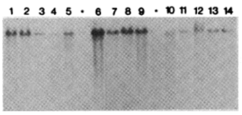

<!-- Limit image width and height -->

<!-- Center image on slide -->

<!-- Italic -->

<!-- Bold -->

--- .segue .dark .nobackground
## Recap

--- &twocol bg:lavender
## Lihtsad retroviirused transformeerivad kana ja hiire rakke

***=left

***=right

Mehhanism: **insertsiooniline mutagenees** 

---
## Inimese vähid kus esineb kõrge viirusekspressioon

<footer class="source">Pilt: [The landscape of viral expression and host gene fusion and adaptation in human cancer](http://www.nature.com/ncomms/2013/131001/ncomms3513/full/ncomms3513.html)
</footer>

---
## Viiruse integratsioon on seotud märklaudgeenide ekspressiooni muutustega

<footer class="source">Pilt: [The landscape of viral expression and host gene fusion and adaptation in human cancer](http://www.nature.com/ncomms/2013/131001/ncomms3513/full/ncomms3513.html)
</footer>

---
## HPV16/18 põhjustab emakakaela kasvajaid

<footer class="source">Bosch FX, Lorincz A, Muñoz N, et al. The causal relation between human papillomavirus and cervical cancer. J Clin Path 2002; 55(4):244-265.
</footer>

--- .segue .dark .nobackground
## Kuidas seletada vähi teket inimesel

--- bg:lavender
## Hüpotees: endogeensed proviirused

- Lähtudes retroviiruste elutsüklist, integreeruvad genoomi **endogeensete retroviirustena**,
- satuvad idutee rakkudesse ja muutuvad pärilikuks,
- enamasti vaikeolekus, ei transkribeeri oma geene,
- juhuslik ning harv aktiveerumine.

--- bg:lavender
## Endogeensed proviirused hiirtel

- BrdU aktiveerib Akr liini hiirtel endogeensed retroviirused (*MLV, murine leukemia virus*)
    - DNA metülatsioon eemaldatakse lookusest ja vaigistamine kaob
- Akr liini hiirtel on kaks lookust kuhu on integreerunud replikatsiooni-kompetentne MLV
- MLV produktsioon viib leukeemia tekkele.

<footer class="source">Pilt: ~5% hiire genoomist sisaldab endogeenseid retroviirus järjestusi. [Endogenous Retroviruses and the Development of Cancer](http://www.jimmunol.org/content/192/4/1343.full)
</footer>

--- bg:lavender
## Inimese ERV-d... FUBAR

- 8% inimese genoomist pärineb retroviirustest, kuid
- inimese kasvajatest pole leitud retroviiruseid ega jälgigi nendest (pöörd-transkriptaas),
- inimese LTR-i sisaldavad järjestused on pärit vähemalt >5M aasta tagusest ajast, 
    - tugevasti muteerunud, 
    - mittefunktsionaalsed,
    - läbinud geenitriivi ja fikseerunud (populatsioonis on kõigil identne lookus).
- HERV-K alamperekonnas on lookuseid millel on kõik ORF-id intaktsed, kuid viirust neilt ei toodeta ja neid pole ka vähkides leitud.

---
## Kui mitte viirused, siis mis tekitab vähki? Kartsinogeenid!

- Kartsinogeenid toimivad mutageenidena ja nende toime-mehhanismiks on raku kasvukontrolli geenide muteerimine.
- Sellisteks kasvukontrolli geenideks võivad olla normaalsed raku geenid, sarnaselt retroviirustest leitud proto-onkogeenidega.

--- &twocol
## Keemilised kartsinogeenid

***=left

Katsusaburō Yamagiwa

***=right
- 1915. aastal demonstreeris **pigi** kartsinogeense toime
- pintseldas küüliku kõrvu igapäevaselt pigiga,
- mitu kuud hiljem moodustus lamerakuline kartsinoom.

**Näitas, et kasvajaid on võimalik esile kutsuda**

---
## Paradigma: kartsinogeenid toimivad mutageenidena

<q>Füüsilise või keemilise katserogeeni poolt transformeerunud rakud kannavad muteerunud geene e. onkogeene, mis rikuvad normaalse kasvukontrolli.</q>

--- &twocol bg:pink
## DNA transfektsioon võimaldas isoleerida mitte-viraalsed onkogeenid

***=left

- Hiire C3HT1/2 rakke transformeeriti 3-metüülkolantreeni (3-ME, MCA) abil,
- transformeerunud rakkudest isoleeriti genoomne DNA,
- eraldatud DNA transformeeriti mitte-tumorigeensetesse NIH3T3 rakkudesse,
- isoleeriti kolooniad mis olid transformeerunud ja tumorigeensed.
- *Sama loogika toimib ka inimese vähirakkudest eraldatud DNA korral.*

***=right

<footer class="source">Pilt: Sue Weil, Memorial Sloan-Kettering Cancer Center
</footer>

--- bg:pink

## 1 onkogeen = 1 transformeerunud rakk/koloonia

- Transformeerunud rakkude genoomse DNA fragmentide transfekteerimisel läheb rakku sisse 0.1% doonor DNA-d.

- Tõenäosus, et kaks lingitud geeni satuvad ühte rakku on $$10^{-3} \times 10^{-3} = 10^{-6} $$ 

<q>Kokkuvõte: onkogeenid tekivad ka viirustest sõltumatult.</q>

--- &twocol bg:pink
## Retroviiruste poolt aktiveeritud onkogeenid on samad mis mitte-viraalsete kartsinogeenide aktiveeritud

- Harvey roti sarkoomiviiruse H-ras proov hübridiseerub inimese kusepõie kartsinoomi DNA-ga transfekteeritud NIH3T3 rakkude genoomsele DNA-le ([Parada et al., 1982](http://www.ncbi.nlm.nih.gov/pubmed/6283357):  paremal).

***=left

Southern bloti põhimõte

***=right

----
## Inimese vähkide retroviraalsed onkogeenid

Viirus | Liik | Onkogeen | Onkovalk | Inimese kasvaja
-------|------|----------|----------|----------------------------
Rousi sarkoom | kana | src | mitte-retseptor TK | käärsoole vähk
Abelsoni leukeemia | hiir | abl | mitte-retseptor TK | CML
Lindude erütroblastoos | hiir | erbB | retseptor TK | mao-, kopsu- ja rinnavähk
McDonough' kassi sarkoom | kass | fms | retseptor TK | AML
Hardy-Zuckerman kassi viirus | kass | kit | retseptor TK | GI strooma vähk
Hiire sarkoom 3611 | hiir | raf | Ser/Thr kinaas | kusepõie kartsinoom
*Simian sarcoma* | ahv | sis | kasvufaktor (PDGF) | erinevad vähid
Harvey' sarkoom | hiir/rott | H-ras | väike G-valk | kusepõie kartsinoom
Kirsten'i sarkoom | hiir/rott | K-ras | väike G-valk | erinevad vähid
Lindude erütroblastoos E26 | kana | ets | transkriptsioonifaktor | leukeemia
Lindude müelotsütoom | kana | myc | transkriptsioonifaktor | erinevad vähid
Retikuloendotelioos | kalkun | rel | transkriptsioonifaktor | lümfoom

---&twocol
## erbB2/neu onkogeeni amplifikatsioon rinnakasvajates

- 1987. a. kirjeldati, seos erbB2/neu geeni amplifikatsiooni ja rinnavähi elulemuse ning relapsi vahel.

***=left

***=right

<footer class="source">Slamon DJ, Clark GM, Wong SG, Levin WJ, Ullrich A, McGuire WLHuman breast cancer: correlation of relapse and survival with amplification of the HER-2/neu oncogene. Science 235: 177-182.
</footer>

---
## Proto-onkogeenide aktivatsioon

Proto-onkogeenide aktivatsioon toimub läbi kahte tüüpi geneetiliste muutuste:

- valguekspressiooni mõjutavad muutused
- valgu struktuuri mõjutavad muutused

---
## Valguekspressiooni mõjutavad muutused

- Normaalsetes rakkudes on proto-onkogeeni ekspressioon kas alla või ülesse reguleeritud omaenda promootori poolt vastusena füsioloogilistele signaalidele

- Retroviirusega seotud onkogeenide puhul läheb geen raku kontrolli alt viiruse kontrolli alla
    - c-myc ekspressioon on füsioloogilistes tingimustes kasvufaktorite kontrolli all
    - AMV (Avian Myeoloblastosis Virus) genoomis hakatakse aga v-myc järjestust konstitutiivselt kõrgelt ekspresseerima, sõltumata füsioloogilistest signaalidest mis seda geeni varem reguleerisid.

---&twocol
## Valgu struktuuri mõjutavad muutused

***=left

- H-ras isoleeriti inimese kusepõie kartsinoomist,
- H-ras ei olnud amplifitseerunud!,
- sekveneerimine näitas somaatilist G->T punktmutatsiooni, mis oli täiesti piisav et H-ras onkogeeniks muuta
- Vähides esinev mutatsioon koodonites 12 või 61 (G12V) muudab Ras-i konstitutiivselt aktiivseks, rikkudes GAP (GTP-ase activating protein) valgu seostumise

***=right

<footer class="source">CLIFFORD J. TABIN, SCOTT M. BRADLEY, CORNELIA I. BARGMANN, ROBERT A. WEINBERG, ALEX G. PAPAGEORGE, EDWARD M. SCOLNICK, RAVI DHAR, DOUGLAS R. LOWY & ESTHER H. CHANG. Mechanism of activation of a human oncogene. Nature 300, 143 - 149 (11 November 1982); doi:10.1038/300143a0
</footer>

---
## Ras-i mutatsioonid
Ras perekonna geenid on vähkides ühed sagedamini muteerunud geenidest

Vähipaige/tüüp | % muteerunud RAS geeniga (homoloog)
---------|-------------------------
kõhunääre | 90 (K)
kilpnääre (papillaarne) | 60 (H,K,N)
kilpnääre (follikulaarne) | 55 (H,K,N)
käärsool | 45 (K)
seminoom | 45 (K,N)
müelodüsplaasia | 40 (N,K)
kops (mitte-väikserakuline) | 35 (K)
AML | 30 (N)
maks | 30 (N)
melanoom | 15 (K)
kusepõis | 10 (K)
neer | 10 (H)

---
## Onkogeenide aktivatsioonimehhanismid

- Regulatoorsed (protoonkogeeni amplifikatsioon, tuumorsupressorgeeni deletsioon)
- Struktuursed (mutatsioonid)
- Regulatoorsed $\times$ Struktuursed

<footer class="source">[Emerging landscape of oncogenic signatures across human cancers](http://www.nature.com/ng/journal/v45/n10/full/ng.2762.html)</footer>

--- 

## c-MYC aktivatsiooni mehhanismid 

Kolm mehhanismi, kõik regulatoorsed:
- proviiruse integratsioon (linnud)
- geeni amplifikatsioon (inimene)
- kromosomaalsed translokatsioonid

--- &twocol

## N-MYC amplifikatsioon pärilikes neuroblastoomides

***=left

Kahte tüüpi amplifikatsioone

- HSR, homogeenselt värvuvad piirkonnad
- DM, *double minutes*: kromosoomi välised partiklid
- amplifikatsioonid on bimodaalsed 10-30 koopiat ja 100-150 koopiat
- lisaks neuroblastoomidele ka teistes neuroektodermaal kasvajates, astrotsütoomid, glioomid, ka väikse-rakulises kopsukasvajas.

***=right

# HSR ja *double minutes* (nooled)

--- &twocol

## Sagedamini amplifitseerunud genoomipiirkonnad

***=left

***=right

# Olulised korduvad fokaalsed koopiaarvu muutused (SCNA)

Top 10:

Geen | Funktsioon
-----|-----------
CCND1 | G1 tsükliin
EGFR | TK retseptor
MYC | transkripts. faktor
ERBB2 | TK retseptor
CCNE1 | G1 tsükliin
MCL1 | anti-apoptootiline valk
MDM2 | p53 E3 ubikvitiini ligaas

<footer class="source">Pan-cancer patterns of somatic copy number alteration. Travis I Zack,  Steven E Schumacher,  Scott L Carter,	Andrew D Cherniack,	Gordon Saksena,	Barbara Tabak,	Michael S Lawrence,	Cheng-Zhong Zhang,	Jeremiah Wala,	Craig H Mermel,	Carrie Sougnez,	Stacey B Gabriel,	Bryan Hernandez,	Hui Shen,	Peter W Laird,	Gad Getz,	Matthew Meyerson	& Rameen Beroukhim Nature Genetics 45, 1134–1140 (2013) doi:10.1038/ng.2760
</footer>

--- &twocol
## MYC translokatsioon

MYC aktivatsioon translokatsioonilise mehhanismi teel

***=left

- Burkitti lümfoomides
- c-myc geene translokeeritakse immunoglobuliini lookusesse kõigis BL.
- Immunoglobulin raske ahel IgH 80%,
$\kappa$ või $\lambda$ kerge ahel, kumbagi 10%.

Translokatsioon | Fuusion | Sagedus
----------------|--------|--------
t(8;14)(q24;q32)| IGH/MYC | 80%
t(2;8)(p12;q24) | IGK/MYC | 10%
t(8;22)(q24;q11) | IGL/MYC | 10 %

***=right

---
## Kokkuvõte

- **Onkogeen** on geen mis võib potentsiaalselt vähki tekitada ja vähkides on nad muteerunud või ekspresseeritud ebanormaalselt kõrgel tasemel.
- **Proto-onkogeen** on normaalne geen mis võib muutuda onkogeeniks.

---
## Refs

- Natalie Teich, Douglas R. Lowy, Janet W. Hartley, Wallace P. Rowe, Studies of the mechanism of induction of infectious murine leukemia virus from AKR mouse embryo cell lines by 5-iododeoxyuridine and 5-bromodeoxyuridine, Virology, Volume 51, Issue 1, January 1973, Pages 163-173, ISSN 0042-6822, [http://dx.doi.org/10.1016/0042-6822(73)90376-0.](http://www.sciencedirect.com/science/article/pii/0042682273903760)

--- .segue .dark .nobackground

## Lingid teistele loengutele

--- &twocol 

***=left 

- [Sissejuhatav loeng](http://rpubs.com/tapa741/sissejuhatus)
- [Vähitüübid](http://rpubs.com/tapa741/vahityybid)
- [Onkoviirused](http://tpall.github.io/Onkoviirused)
- [Onkogeenid](http://tpall.github.io/Onkogeenid)
- [Retseptorid](http://tpall.github.io/Retseptorid)
- [Signaalirajad](http://tpall.github.io/Signaalirajad)
- [Tuumorsupressorgeenid](http://tpall.github.io/Tuumorsupressorid)
- [Rakutsüklikontroll](http://tpall.github.io/Rakutsyklikontroll)

***=right 

- [p53 ja apoptoos](http://tpall.github.io/p53-ja-apoptoos)
- [Immortalisatsioon](http://tpall.github.io/Immortalisatsioon)
- [Tumorigenees](http://tpall.github.io/Tumorigenees)
- [Genoomiterviklikkus](http://tpall.github.io/Genoomiterviklikkus)
- [Mikrokeskkond](http://tpall.github.io/Mikrokeskkond)
- [Metastaasid](http://tpall.github.io/Metastaas)
- [Immuunsus](http://tpall.github.io/Immuunsus)
- [Vähiravimid](http://tpall.github.io/Vahiravim)
